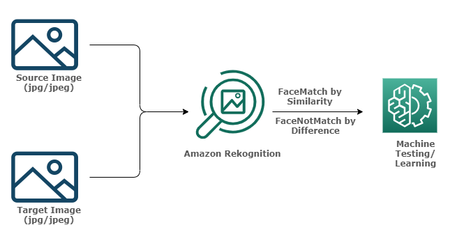
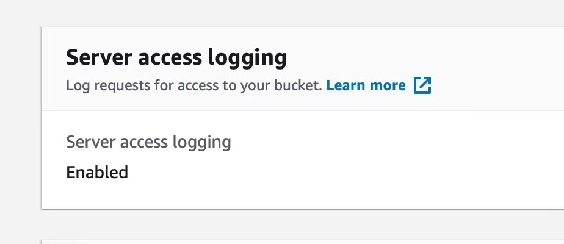
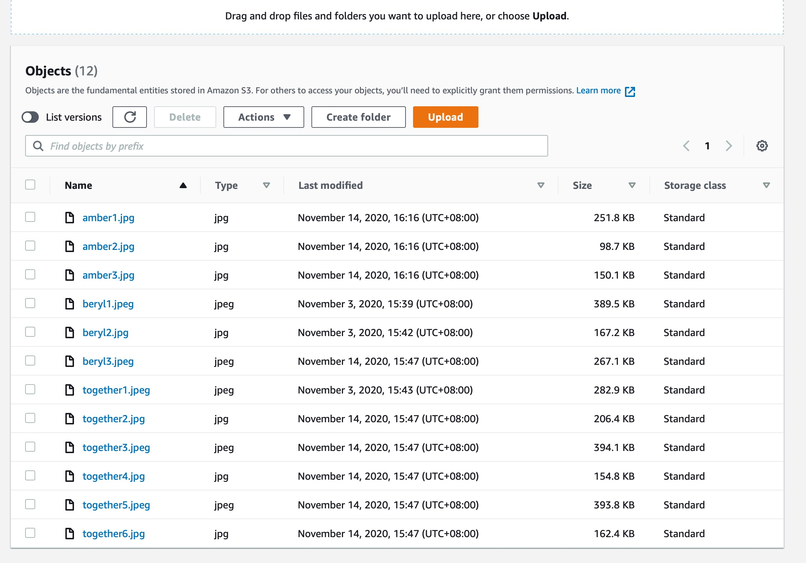
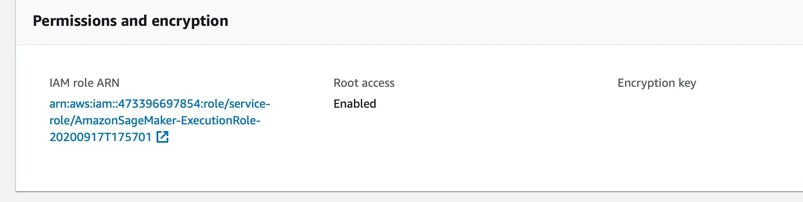
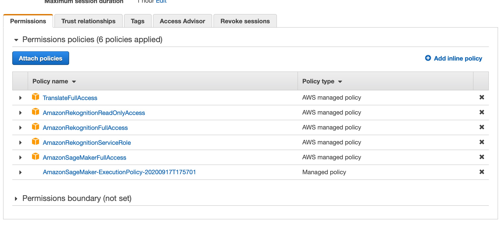

# Amazon Rekognition Extreme Cases Testing
This project demonstrates how to test the accuracy of [Amazon Rekognition](https://docs.aws.amazon.com/rekognition/index.html) under extreme cases. The two main study focuses are: 1) identical twins and 2) facial variations. In the identical twins study, we tested if Amazon Rekognition recognize the twin sister with similar confidence scores as her twin. In the facial variations study, we tested if Amazon Rekognition recognize individuals with similar confidence scores when they have minor variations on their faces. 

## Architecture Overview

The architecture diagram below provides an overview of this project.



We first upload the source image and target image to an Amazon Simple Storage Service (S3) web bucket. The S3 bucket is then changed to public access. The Amazon Rekognition is being accessed by setting up AWS IAM role. With the S3 bucket and Amazon Rekognition all set up, we can use Rekognition to test the source and target images uploaded to the S3 bucket. We focused on the FaceMatch function for finding similarities and the FaceNotMatch funciton for finding differences. From the results, we can perform further machine testing or machine learning.

## Data Collection

We collect the images from our friends and families and found pictures of celebrities online. We gather the image resources of twin sisters, as well as those featuring appearance changes(glass/ makeup/ funny faces) via social connections. For the later, we gathered 30+ groups of data each containing a set of four photos of the same person. Each group of data contains:
- a regular photo with the entire face exposed :smiley:
- a photo with the person wearing mask 😷
- a photo with the person wearing glasses :nerd_face:
- a photo with the person doing funny face :stuck_out_tongue_winking_eye:


## Workflow

### Create S3 bucket

First of all, we create an [S3 bucket](https://docs.aws.amazon.com/AmazonS3/latest/dev/Welcome.html) on AWS. We need to make sure that we make the bucket public. 



Secondly, we push all of our images into the bucket. Remeber, the images should also be made public. As you can see, we have images of the twin sisters in the bucket, you can put images that you want to work with in your s3. 



### Set up an IAM role

Then we set up the IAM role. After clicking on the name of your Sagemaker notebook, you will be able to set the IAM role as ARN. 



### Access Amazon Rekognition

We need to go to the "permissions" tab and make sure that we have full access to Amazon Rekognition. 


### Set up the AWS CLI

In any new Sagemaker instance, the AWS CLI (Command Line Interface) comes preinstalled. So as we are using AWS Sagemaker, we can skip this step, or check that by running the following command. We then get access to our S3 bucket.

```python
!aws rekognition help
!aws s3 help
!aws s3 ls s3://350-rekog-project
```

### Using the python SDK

We start by importing the package which containts the code for the Python SDK, [boto3](https://aws.amazon.com/sdk-for-python/).

```python
import boto3
```

Then, we create an instance of the client object in the boto3 package for rekognition. It will allow us to communicate and make requests to the Amazon Rekognition service using Python.

```python
client=boto3.client('rekognition')
```
Next, we can access the **compare_faces** method in the rekognition package.

SimilarityThershold specifies the minimum level of confidence in the match that you want returned in the response. SourceImage is the where we detect faces and use it to compare with the TargetImage. If there are multiple faces in the source image, the largest face will be used for comparison. SourceImage and TargetImage take a S3Object with at least two parameters of strings. Bucket is a string of the bucket name and Name is a string of the image filename. The images must be PNG or JPEG files.

We can find guidance for additional parameters and requirements from [Amazon Rekognition Developer Guide for CompareFaces.](https://docs.aws.amazon.com/rekognition/latest/dg/API_CompareFaces.html)

In the following example, we used the photo of one of the twins as the source image to compare with a photo with both the twins.

```python
response=client.compare_faces(SimilarityThreshold=80,
                                  SourceImage={'S3Object':{'Bucket':"350-rekog-project",'Name':"beryl1.jpeg"}},
                                  TargetImage={'S3Object':{'Bucket':"350-rekog-project",'Name':"together1.jpeg"}})
```
